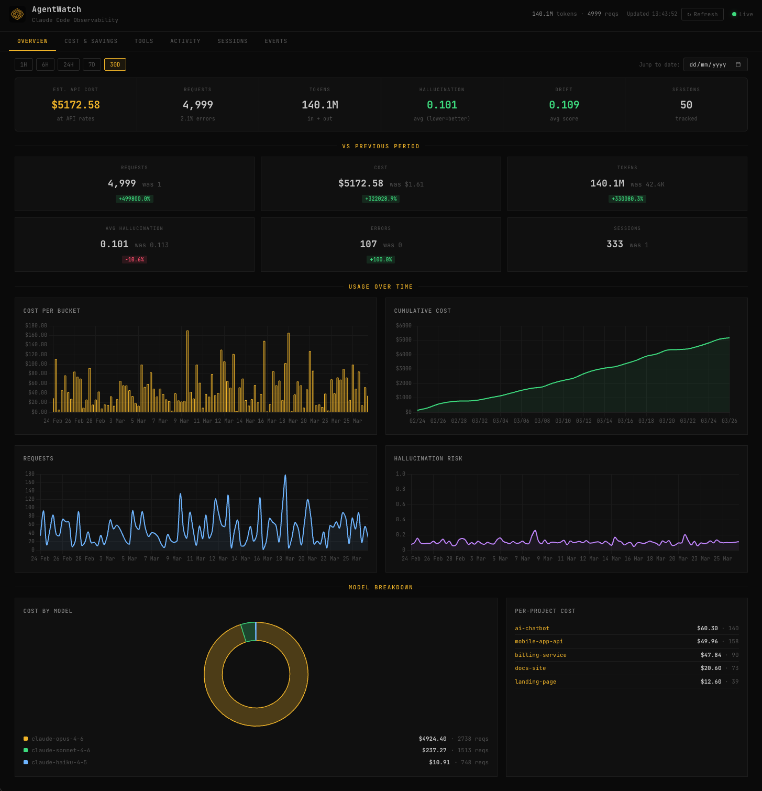
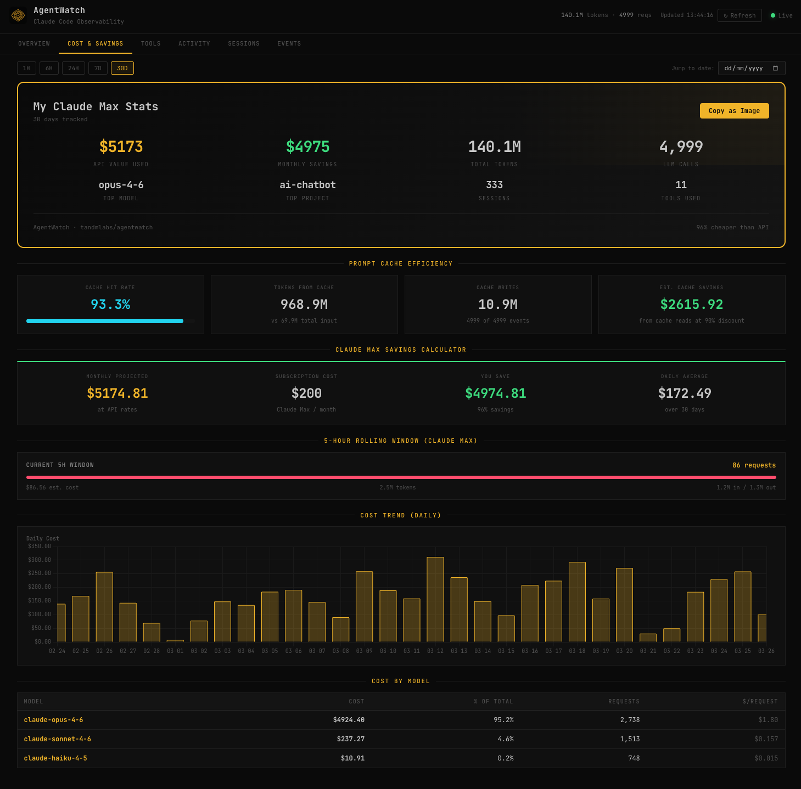
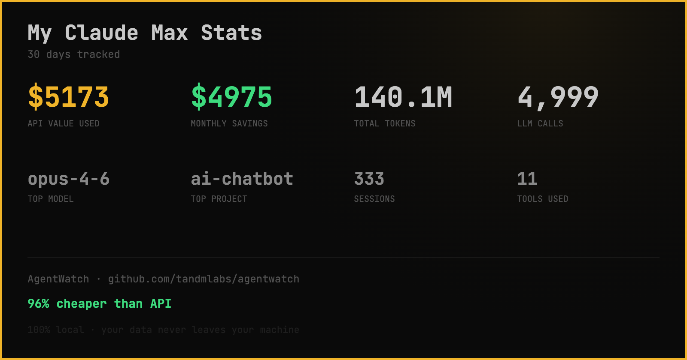
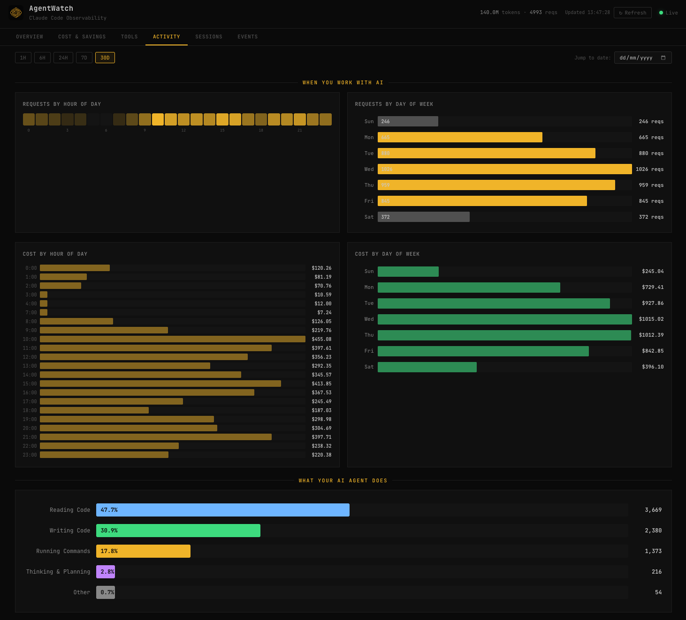
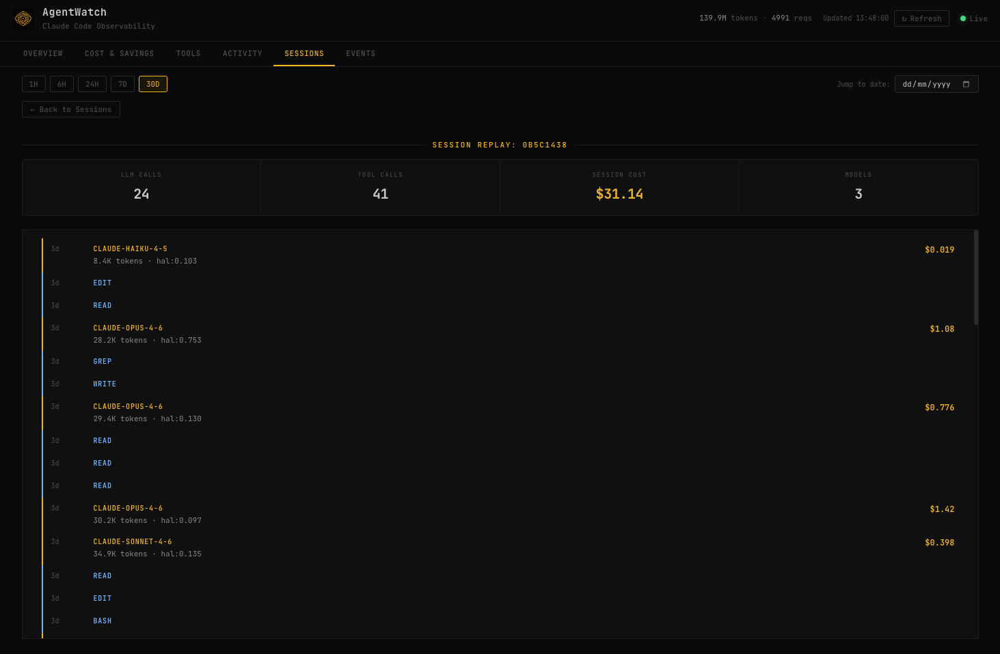

<p align="center">
  
</p>

<h1 align="center">AgentWatch</h1>

<p align="center">
  <strong>See what your Claude Max subscription is really worth.</strong>
</p>

<p align="center">
  <a href="#quick-start">Quick Start</a> &middot;
  <a href="#features">Features</a> &middot;
  <a href="#how-it-works">How It Works</a> &middot;
  <a href="#contributing">Contributing</a>
</p>

<p align="center">
  
  
  
  
  
</p>

<br />

<p align="center">
  <video src="https://github.com/user-attachments/assets/demo.mp4" width="800" autoplay loop muted>
    
  </video>
</p>

> **Note:** The video above may not render in all browsers. [Watch the demo](docs/demo.mp4) or see the [screenshots below](#features).

---

## The problem

You're paying $200/month for Claude Max. You use it every day. But you have **zero visibility** into:

- What would this cost at API rates? Is Max actually saving you money?
- Which projects are eating the most tokens?
- What does your AI agent actually *do* all day?
- How much are you benefiting from prompt caching?
- When are your peak usage hours?

You're flying blind. AgentWatch fixes that.

## The answer

AgentWatch reads your local Claude Code session logs and gives you a full observability dashboard — **costs, tokens, tools, sessions, projects, and activity patterns** — all running on your machine. No cloud. No accounts. No data leaves your computer.

```
Your Claude Max subscription:              $200/month
What it would cost at API rates:         $5,174/month
You save:                                $4,974/month (96%)
```

> **Not an enterprise platform.** AgentWatch is a lightweight, local-first tool for individual developers. If you need multi-agent orchestration across teams, check out [Paperclip](https://github.com/paperclipai/paperclip).

---

## Quick start

```bash
git clone https://github.com/zmaxgong/agentwatch.git
cd agentwatch

# Start with your real Claude Code data
./start.sh --claude

# Or explore with demo data first
./start.sh
```

Then open `dashboard/index.html` in your browser. That's it.

### Live mode

```bash
# Watch for new Claude Code activity in real-time
./start.sh --watch
```

New events appear on the dashboard as you use Claude Code.

### Requirements

- Python 3.9+
- That's it. No Node.js, no Docker, no cloud accounts.

---

## Features

### Savings calculator + cache efficiency

See exactly how much your Claude Max subscription saves you compared to API pricing — monthly projections, daily averages, per-model cost breakdowns, and prompt cache hit rates with estimated cache savings.



### Shareable stats card

Hit **"Copy as Image"** to generate a stats card you can paste anywhere — Twitter, Slack, Discord. Shows your API value, monthly savings, top model, top project, total tokens, and session count.



### Activity patterns

Hour-of-day heatmap and day-of-week breakdown. See when you work with AI most, which hours cost the most, and what your agent actually does — categorized into Reading Code, Writing Code, Running Commands, and Thinking.



### Session replay

Click any session to replay it turn by turn. See every LLM call, every tool use, token counts, costs, and model choices — in chronological order.



---

## Dashboard tabs

| Tab | What it shows |
|-----|--------------|
| **Overview** | KPIs, cumulative cost chart, model breakdown, per-project costs, period-over-period comparison |
| **Cost & Savings** | Shareable stats card, cache efficiency, savings calculator, 5h billing window, cost trends |
| **Tools** | Tool usage percentages at a glance, detailed breakdown bars, tools by project |
| **Activity** | Hour-of-day heatmap, day-of-week patterns, cost by time, "what your AI does" categories |
| **Sessions** | All sessions with sortable columns, click any row to replay turn-by-turn |
| **Events** | Full event log with type filtering and column sorting |

---

## How it works

```
Claude Code logs          AgentWatch              Dashboard
~/.claude/projects/       Python backend           Single HTML file
┌──────────────┐         ┌───────────────┐        ┌──────────────┐
│ JSONL session │         │ Import &      │        │ Real-time    │
│ logs (local)  │────────>│ parse logs    │───────>│ charts &     │
│              │         │ SQLite store  │        │ tables       │
│              │         │ REST API      │        │ (Chart.js)   │
└──────────────┘         └───────────────┘        └──────────────┘
```

**Everything stays on your machine.** No cloud services. No telemetry. No data collection. The SQLite database lives in `/tmp` by default and is never transmitted anywhere.

---

## Privacy

AgentWatch is **100% local by design**:

- Your Claude Code session logs are read from your local filesystem
- All data stays in a local SQLite database
- The dashboard is a static HTML file — no external server
- No analytics, no tracking, no phone-home
- The backend runs on `localhost` only
- Nothing is ever uploaded, shared, or transmitted

When you open-source your fork or share screenshots, only the aggregated stats you explicitly copy are shared — never raw session data.

---

## SDK integration (for API users)

If you use the Anthropic API directly (not Claude Code), wrap your client:

```python
from agentwatch import AgentWatch, MonitoredClient, AgentWatchConfig

aw = AgentWatch(AgentWatchConfig(project_id="my-app"))
aw.start_session()

# Wrap your Anthropic client — everything else stays the same
client = MonitoredClient(aw)
response = client.messages.create(
    model="claude-sonnet-4-6",
    max_tokens=1024,
    messages=[{"role": "user", "content": "Hello"}]
)
```

Or wrap an existing client:

```python
import anthropic
existing = anthropic.Anthropic(base_url="...", api_key="...")
client = MonitoredClient(aw, client=existing)
```

---

## Project structure

```
agentwatch/
├── sdk/                         # Python SDK (zero mandatory dependencies)
│   └── agentwatch/
│       ├── client.py            # Core telemetry client
│       ├── wrapper.py           # Drop-in Anthropic wrapper
│       ├── claude_code_import.py # Claude Code log importer
│       ├── config.py            # Configuration & model pricing
│       ├── events.py            # Event types & data structures
│       └── detectors.py         # Hallucination, drift, security detection
├── backend/
│   └── server.py                # FastAPI backend with SQLite
├── dashboard/
│   ├── index.html               # Self-contained dashboard (vanilla JS + Chart.js)
│   └── assets/                  # Logo, favicons
├── examples/
│   ├── quickstart.py            # Anthropic wrapper example
│   ├── manual_tracking.py       # Manual recording example
│   └── demo_data.py             # Realistic demo data generator
├── tests/                       # Test suite
├── start.sh                     # One-command setup
└── .github/workflows/ci.yml     # CI pipeline
```

## Configuration

AgentWatch works out of the box. For customization:

| Environment Variable | Default | Description |
|---------------------|---------|-------------|
| `AGENTWATCH_DB` | `/tmp/agentwatch.db` | SQLite database path |

SDK options (cost alert thresholds, detection toggles, batching) are in `sdk/agentwatch/config.py`.

---

## Contributing

See [CONTRIBUTING.md](CONTRIBUTING.md). Bug reports, feature requests, and PRs are welcome.

## Security

See [SECURITY.md](SECURITY.md) for our security policy.

## License

MIT — see [LICENSE](LICENSE).

---

<p align="center">
  <sub>Built by <a href="https://tandmlabs.com">Tandm Labs</a> — a human-AI company.</sub>
</p>
